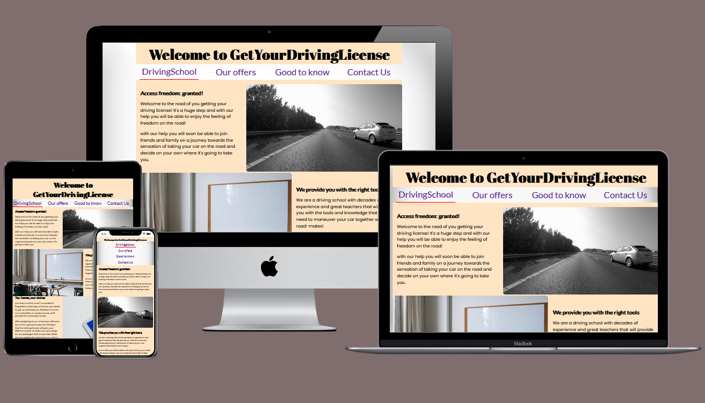
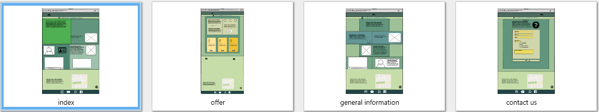
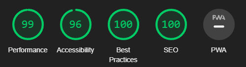
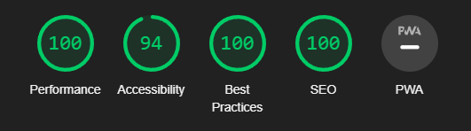

# Drivingschool
Drivingschool is a landing page for a fictive driving school. It aims at people who want to learn how to drive and get a Swedish license. You get information from the school and what deals they have. Read-upon the road-trip of getting a license in Sweden. 
While the site is fictive I see a need in real life to establish some kind of standard on how driving schools present themselves on the web. Some are better then others but there is a need of a proper homepage to reel customers in and expand their brand online. 

The official address: https://awrelh.github.io/drivingschool/

The project was made using HTML and CSS. 

## Initial concept
I started with writing down my ideas and then I drew down my layout on some paper and moved on to do it digital on Basamiq Wiresframes. Below you have a first draft. The finished product moved away from the green color and changed a bit of its layout.

## Features

On each page you have a welcome title, a navigation bar, location information and a footer. Furthermore, on each page you have a main content area between the navigation bar and the map area. The view width is 1200px and centered on larger screens.

### Navigation

The navigation bar is centered with space-around each page-link across the screen on devices that are bigger than 650px, below that the links will stack on top of each other. 

**DrivingSchool**- is the first page, the homepage.     
**Our Offers** - is the page where you can read on the offers that are available.   
**Good to know** - is general/official information regarding getting a license in Sweden.  
**Contact Us** - is where you can contact the school and take it to the next stage. 

Style wise the font-size is a bit larger for an easy layout and accessibility. 

### map area and footer
These are located in the bottom of each page. The point is to repeat the school's location and social media presence to potential costumer. Location is fictive, and the social media symbols will only take you their official homepages. 

### Main content
the index page consist of an introduction of the school and the goal is to paint a picture of accessing freedom when getting a license via the school and classroom and its teachers. 
the second page is where the offer packages are presented and also two testimonials about how great school it is. 
In the 'good to know' page you have a roadmap on how to get your Swedish license and also a few additional links and a video. And on the last page you have a form to fill with contact information and what kind of license or education you are interested in. 

## Colours

The colours that appear in this home page are following:
**bisque**, **#91E0C6**, **#F1F3F4**, **#FFB027** and **white** since the max-width is 1200px on larger screens and the content is not stretching 100% on all screens. 

# Testing and local deployment

I have mostly used Firefox with my testing since it's my primary browser, but I also used Google Chrome. Used an extension named Live Server to see how my project would evolve through each new segment of code. 

With the dev-tools and media queries I made sure my project was responsive and did what I expected it to do when going from bigger to a smaller screen. Made sure links open correctly and in new tab and imagery was responsive according to my expectations. 

## Validator testing

**HTML** - Error appeared regarding my favicon it was of type="image", which was not 100% correct. I had also missed some stray end div tags. With one iframe I had a frame border that caused an error. In the contact us page I had a section without a heading and that was changed to a div instead. I had also missed adding ID to two input tags. 
Errors were all corrected. 

**CSS** - There were two errors in my CSS, and they were of the same kind. Were coding 'scale:0.5' instead of 'transform:style(.5)'. Also corrected. 

**Accessibility** - According to the lighthouse test results from Google Chrome dev-tools accessibility of my project were good, spanning from desktop to mobile. Also used Firefox's accessibility tools to render how my project would look like for a colorblind person. 

Index.html

Offers.html

The other pages had similar values, while best practice had a little bump, yet green number, on generalinfo.html.

### Bugs
I had a few bugs during my project, one of them was the open and close-quote that was used with the testimonials, quotation didn't appear and after some time I managed to see that there was a spelling mistake that was causing me the headache. 

Another issue that I had when making my index.html responsive while shrinking it, I would have an image appearing first instead of a text on the second section. Now I could've just change places in the HTML, the text and the image, but I would rather keep my design so after some time, googling to find a solution, I landed on grid and order to manipulate this issue. 

One of the last bugs that I was confronted with was with aspect-ratio of my index-images. During the accessibility tests I wanted to improve my performance score, and recommendations from the software introduced me to add height and width in the HTML and some CSS code. That solution cause my images to fault and after some tries I removed this implementation and the performance score when up. 

# Future features

Ideas that could be added to this project:
- login page for student, with additional study material
- make a hamburger of the navigation bar when going down some screen sizes
- buy packages from the site
- add graphics or text when the driving school is open
- sections for different type of vehicles 
- booking of lessons in a calendar

---
## Credits

### Media